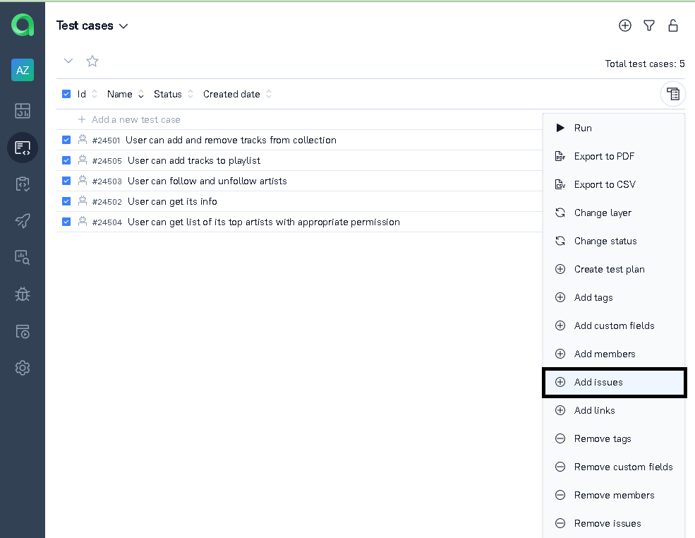

## Проект API - автотестов для стримингового сервиса Spotify

### Основные моменты
- Тест-кейсы разработаны на языке Python с использованием фреймворков Selene, Pytest. 
- Используется Allure Reports для  генерации отчетности и интерграции с системой тест-менеджмента Allure Test Ops
- Реализована интеграция с системой трекинга ошибок Jira
- Оповещение о результатах выполнения тестов приходят в Telegram
- Токен для работы API - запросов запрашиваетс в UI

## Используемые технологии

  <code></code>
  <code></code>
  <code></code>
  <code></code>
  <code></code>
  <code></code>
  <code></code>
  <code></code>
  <code></code>
  <code></code>
  <code></code>
  <code></code>

## Реализованные тест-кейсы

- Просмотр информации о пользователе
- Отслеживание исполнителей и отмена отслеживания
- Добавление треков в понравившиеся и удаление из понравившегося
- Создание плейлиста, добавление и удаление треков в плейлисте
- Просмотр топ-списка

## Настройка проекта для удаленного запуска
- Создать аккаунт на Spotify через электронную почту, в разделе разработчика добавить приложение

- Переименовать файл .env.example в .env, внести свои данные

- Настроить запуск тестов из [Jenkins](https://jenkins.autotests.cloud/job/azavialov-qa-guru-python-5-API/) и нажать "Собрать сейчас". Пример завершенной сборки по [ссылке](https://jenkins.autotests.cloud/job/azavialov-qa-guru-python-5-API/9/).

- Информация о прохождении тестов доступна в Allure - отчете сборки, в аттачментах есть cURL, JSON ответа

- В разделе Graphs доступна статистика прохождения тест-кейсов

## Интеграция с Allure TestOps 
- После выполнения в Allure Test Ops создаются тест-кейсы с уже заполненными шагами, которые берутся из лямбда-степов внутри тест-кейсов

В этом же списке можно вручную добавить ручной тест-кейс

- Суммарная информация по автоматизированным и ручным кейсам доступна в дашборде

## Интеграция с Jira
- К уже созданной в Jira задаче в разделе сьютов Allure Test Ops можно привязать тест-кейсы

- Из раздела Launches можно привязать тестовый прогон

- Тикет в Jira

## Настроена отправка отчета в Telegram

